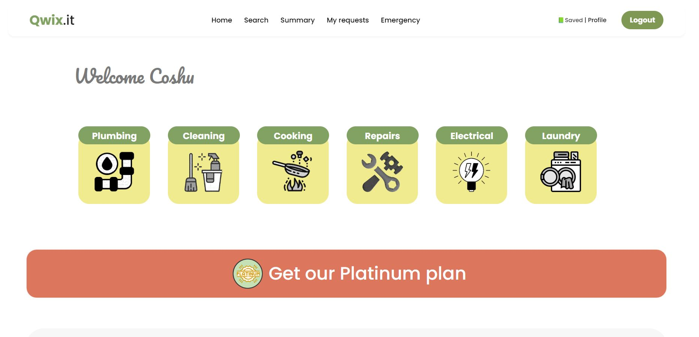
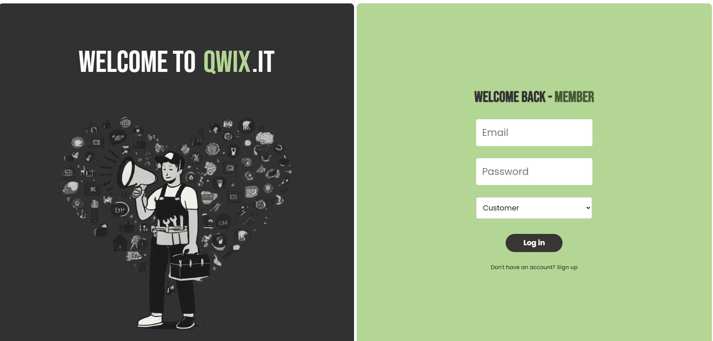
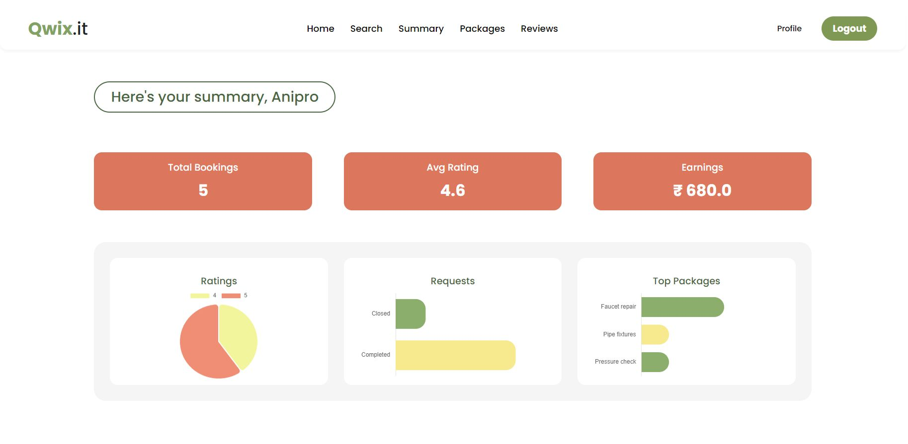

Qwix – Home Services Management Platform

Qwix is a Flask-based home services management platform that connects customers, service professionals, and administrators through a single web application. Customers can discover services and packages, request services, track requests, save packages, and submit reviews, while professionals can manage their service offerings and administrators can manage users, professionals, services, and requests.

✨ Features

Customer

Customer registration and secure login

Customer dashboard and profile management

Browse available home services

Search and view service packages

Save/unsave service packages

Request services from professionals

Track service-request status

View service history

Submit ratings and reviews

Access normal, premium/platinum, and emergency services

Service Professional

Professional registration with document proof upload

Professional login and profile management

Service/package management

View and manage customer service requests

Track service status and completion information

Experience, pricing, rating, and service-category information

Administrator

Admin authentication

Manage customers and professionals

Approve/reject professional registrations

Block/unblock users and professionals

Manage services and service packages

Monitor service requests

Review platform activity and summaries

🛠️ Tech Stack

Layer

Technology

Backend

Python, Flask

ORM

Flask-SQLAlchemy / SQLAlchemy

Database

SQLite

API

Flask-RESTful

API Documentation

Flasgger / Swagger

Authentication

Flask sessions + Werkzeug password hashing

Frontend

HTML, CSS, Jinja2 templates

Timezone

pytz

Environment

python-dotenv

📁 Project Structure

qwix-new-main/
└── qwix/
    ├── main.py                  # Application entry point
    ├── requirements.txt         # Python dependencies
    ├── instance/
    │   └── database.sqlite3     # SQLite database
    ├── pics/                    # Project/reference images
    └── webapp/
        ├── __init__.py          # Flask app and database configuration
        ├── apis.py              # REST API endpoints
        ├── models.py            # Database models and seed data
        ├── views.py             # Web routes and application logic
        ├── templates/            # Jinja2 HTML templates
        └── static/               # CSS, images, documents and assets

🗄️ Database Models

The application uses SQLite with the following primary models:

User – customer/admin accounts and profile information

Professional – service-provider profiles, approval status, experience, pricing and documents

Service – categories such as Plumbing, Cleaning, Cooking, Repairs, Electrical and Laundry

ServicePackage – individual packages offered for a service

ServiceRequest – customer requests and their lifecycle/status

Review – customer ratings and comments for completed services

🚀 Getting Started

1. Clone the repository

git clone https://github.com/<your-username>/<your-repository>.git
cd <your-repository>/qwix

2. Create a virtual environment

Windows:

python -m venv venv
venv\Scripts\activate

Linux/macOS:

python3 -m venv venv
source venv/bin/activate

3. Install dependencies

pip install -r requirements.txt

4. Run the application

python main.py

The application runs on:

http://127.0.0.1:5000

The application also reads the PORT environment variable, which makes it suitable for deployment platforms that provide a dynamic port.

🔌 API

Qwix provides REST APIs for authentication, registration, customer operations, service packages, service requests, and other application functions.

API documentation is available through Swagger/Flasgger at:

http://127.0.0.1:5000/apidocs

A Postman collection is included in the project:

qwix_it.postman_collection.json

🔑 Authentication & Roles

The platform supports three main roles:

customer

professional

admin

Authentication is handled using Flask sessions. Passwords are stored using Werkzeug password hashing rather than plain-text passwords.

🧪 Sample Data

The application initializes the SQLite database with sample users, professionals, services, packages, service requests, and reviews when the corresponding tables are empty.

Security note: The current development database and source code contain sample credentials and a development Flask secret key. Before deploying publicly, replace/remove sample credentials, use environment variables for secrets, and regenerate the production database.

⚙️ Configuration

The current application uses SQLite by default:

SQLALCHEMY_DATABASE_URI = 'sqlite:///database.sqlite3'

For production deployment, consider:

Moving SECRET_KEY to an environment variable

Using a production database such as PostgreSQL or MySQL

Disabling Flask debug mode

Configuring secure session cookies

Validating uploaded documents more strictly

Removing development/sample credentials

Adding CSRF protection where appropriate

📸 Screenshots

The repository contains application screenshots in the pics/ directory and UI assets under webapp/static/.

Screenshots:

🔄 Typical User Flow

Customer
   │
   ├── Register / Login
   │
   ├── Browse Services
   │       └── View Packages
   │
   ├── Save Package
   │
   ├── Request Service
   │       └── Professional accepts/rejects
   │
   ├── Track Service
   │
   └── Complete Service → Rating & Review

Professional
   │
   ├── Register + Upload Documents
   ├── Admin Approval
   ├── Create/Manage Packages
   └── Handle Service Requests

Admin
   │
   ├── Manage Users
   ├── Manage Professionals
   ├── Manage Services/Packages
   └── Monitor Requests

📦 Dependencies

The main Python dependencies are:

Flask==2.2.5
Flask-SQLAlchemy==3.0.5
python-dotenv==1.0.0
Werkzeug==3.0.0
pytz==2023.3
flasgger==0.9.5
Flask-RESTful==0.3.10

Install them with:

pip install -r requirements.txt

🌐 Deployment

main.py reads the PORT environment variable and binds Flask to 0.0.0.0, allowing the application to be deployed on services such as Render or similar platforms.

For a production deployment, configure the following environment variables/secrets as appropriate:

PORT=<platform-provided-port>
SECRET_KEY=<strong-random-secret>

A production WSGI server such as Gunicorn is also recommended instead of Flask's development server.

Example:

gunicorn main:app

🧑‍💻 Future Improvements

PostgreSQL/MySQL production database support

Payment gateway integration

Email/SMS notifications

Real-time service-request updates

Location-based professional search

Advanced filtering and sorting

Automated professional verification

Better role-based authorization and security controls

ask project for managing home-se
